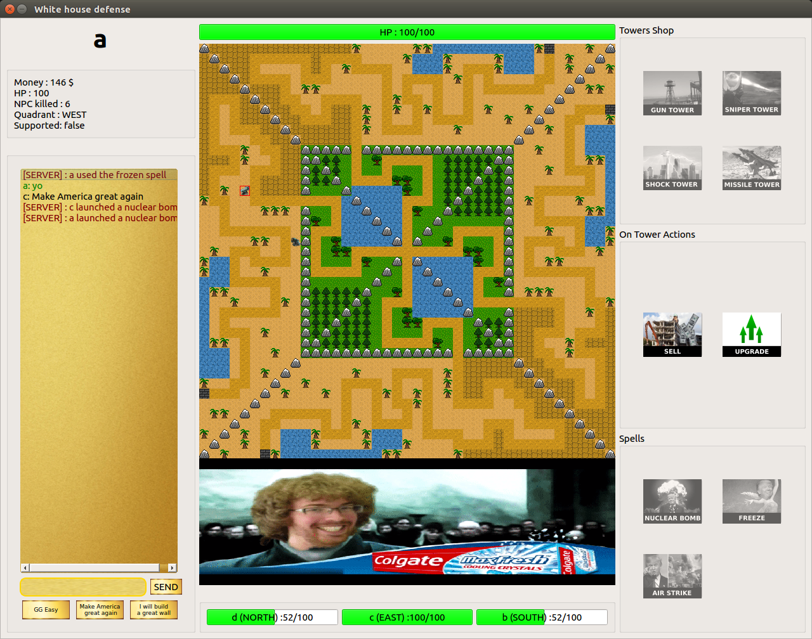
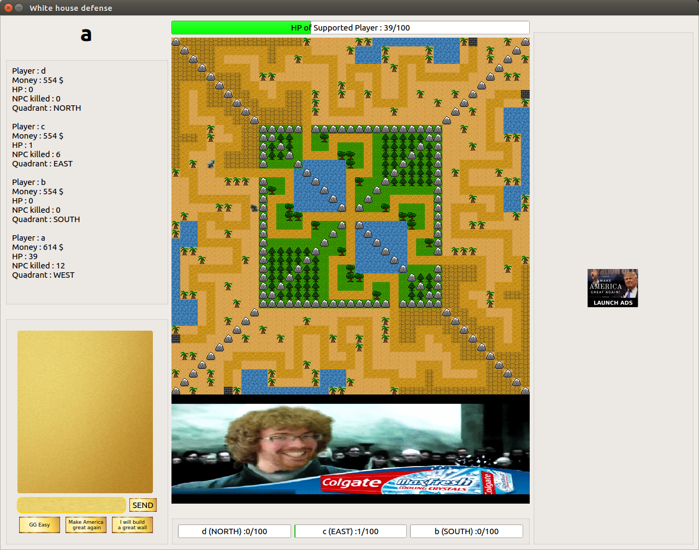
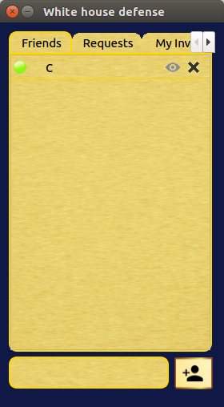
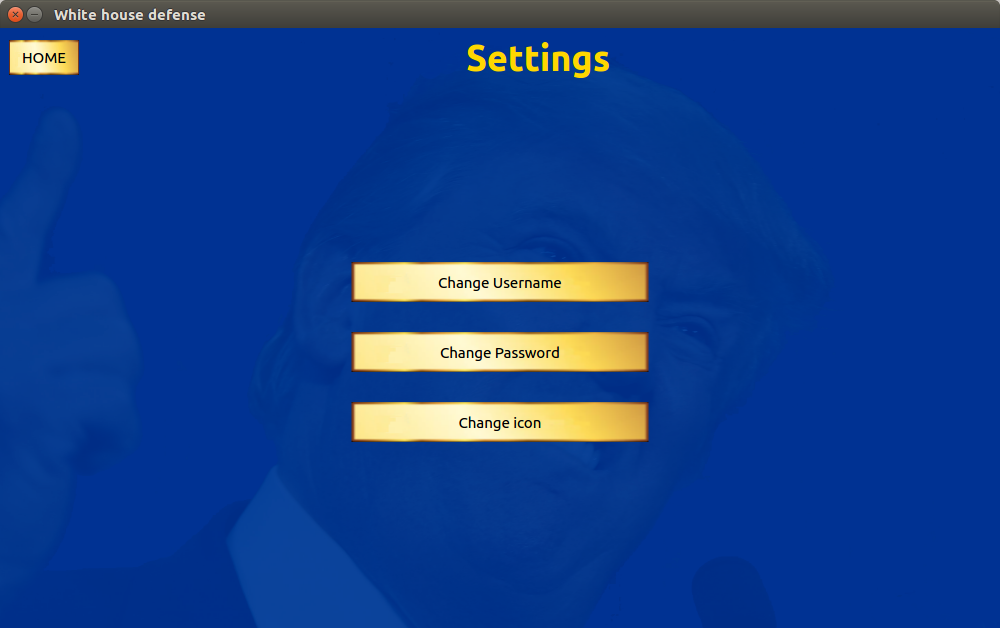
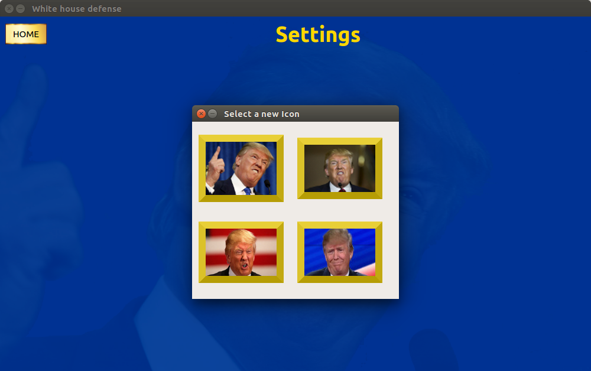

LE SRD EST DISPONIBLE DANS LE DOSSIER "SRD"

## Compilation
	mkdir build && cd build
	cmake ..
	make
Les executables seront placés dans build/code. Il faut mettre la database qui est dans le dossier database/ dans build/code

cmake version >= 3.6 (lien d'installation cmake 3.8 : https://cmake.org/download/)

## Screenshots

